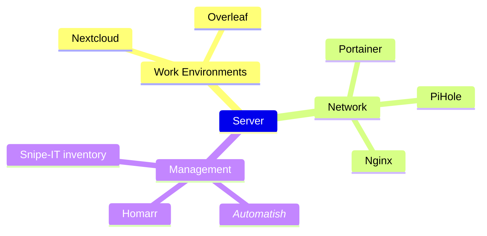

# IE University Robotics Research Lab Server

## Services

| Service   | Ports           | Description              | Access                           |
|-----------|-----------------|--------------------------|----------------------------------|
| Pi-hole   | 53, 67, 80, 443 | Network-wide ad-blocking | `http://<your-server-ip>/admin/` |
| Nextcloud | 8080            | File hosting service     | `http://<your-server-ip>:8080/`  |
